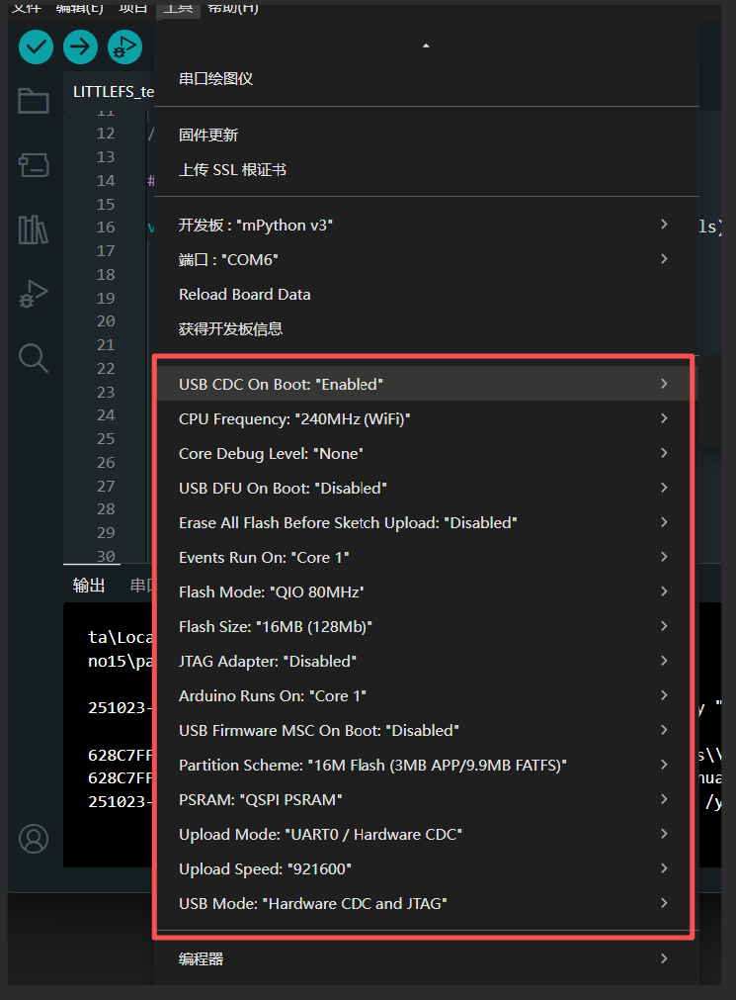

# 创建仓库

乐鑫官方维护了一个esp32的arduino仓库：

- [仓库地址](https://github.com/espressif/arduino-esp32)

- [仓库文档](https://docs.espressif.com/projects/arduino-esp32/en/latest/getting_started.html)

从官方克隆仓库master和gh_pages分支，arduino官方的开发板管理器需要的json文件放在gh_pages分支。

## 创建arduion开发板管理器json文件链接

- 把gh-pages设为缺省分支
- 创建一个仓库网站

  GitHub Settings选择github Pages,简单使用GitHub Actions建即可，创建后，在页面点visit site看是否能访问。

- 复制并修改json文件

  复制package_esp32_dev_index_cn.json文件（此文件下载链接为国内服务器）并修改：
  1. package名："name": "mpython"，这个是C:\Users\你的用户名\AppData\Local\Arduino15\packages下的对应package名。
  2. 修改邮箱
  3. platforms下添加支持的版本
    - platform名："name": "labplus_esp32s3"
    - package下载链接、hash值、文件大小。
    - 此版本支持的板名，此名会显示在arduino的board选择上。
  4. tools栏不动，esp32的一些工具下载链接。

  json文件创建完后，可用[json文件链接](https://labplus-cn.github.io/arduino-esp32/package_esp32_mpython_index.json)访问，可能要等一会。

# package制作

从gh-pages分支下package_esp32_dev_index_cn.json文件中找到3.2.4 3.3.0 3.3.3 3.3.4内个版package文件链接，下载对应版本的package。

做以下修改：

1. 修改boards.txt文件
- 删除已有的所有板子信息，复制M5Stack的3.2.4版本的M5CoreS3 board配置，创建两个板子：
    - labplus_mpython_v3.name=mPython v3
    - labplus_Ledong_v2.name=labplus Ledong v2

    注意：

    - labplus_mpython_v3跟variants下对应板子的文件夹名相同。mPython v3跟json定义的板名相同。
    - 每个板子的每个缺省配置为该配置的第一项，注意放置顺序。会体现在arduino的板子配置信息中，如下图：

  

2.修改variants删除所有板子，新增labplus_mpython_v3 labplus_Ledong_v2两个板子。

# 制作release发布包

把待发布包制作为zip格式压缩包。在gh-packagef使用release发布，zip文件链接及hash值、文件大小复制到json文件对应版本中。

# 修改、增加partition和bootload

参阅[Arduino IDE增加ESP32flash分区配置选项](https://blog.csdn.net/weixin_42880082/article/details/119547440)